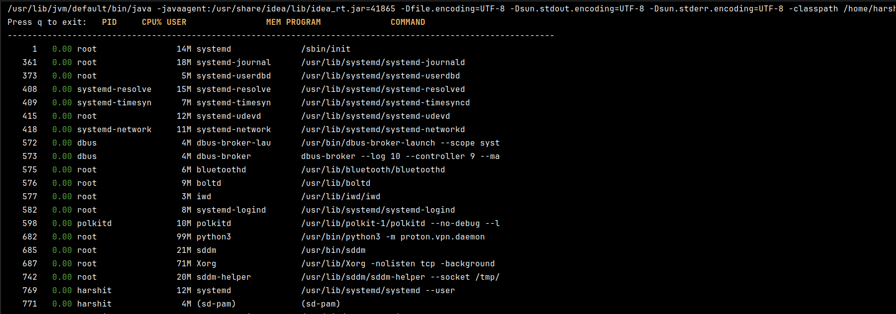
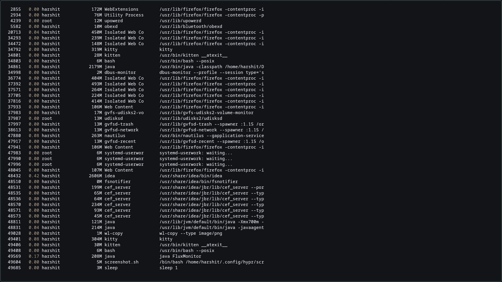

```
███████╗██╗     ██╗   ██╗██╗  ██╗███╗   ███╗ ██████╗ ███╗   ██╗██╗████████╗ ██████╗ ██████╗
██╔════╝██║     ██║   ██║╚██╗██╔╝████╗ ████║██╔═══██╗████╗  ██║██║╚══██╔══╝██╔═══██╗██╔══██╗
█████╗  ██║     ██║   ██║ ╚███╔╝ ██╔████╔██║██║   ██║██╔██╗ ██║██║   ██║   ██║   ██║██████╔╝
██╔══╝  ██║     ██║   ██║ ██╔██╗ ██║╚██╔╝██║██║   ██║██║╚██╗██║██║   ██║   ██║   ██║██╔══██╗
██║     ███████╗╚██████╔╝██╔╝ ██╗██║ ╚═╝ ██║╚██████╔╝██║ ╚████║██║   ██║   ╚██████╔╝██║  ██║
╚═╝     ╚══════╝ ╚═════╝ ╚═╝  ╚═╝╚═╝     ╚═╝ ╚═════╝ ╚═╝  ╚═══╝╚═╝   ╚═╝    ╚═════╝ ╚═╝  ╚═╝
```

> Real-time Linux process monitor in Java. No libraries. No `ps`. No `top`. Just raw `/proc`.


---

## What it looks like


*Boot view — system processes, users resolved, memory and CPU live*


*Full session — Firefox, IntelliJ (2179M), kitty, bash. FluxMonitor watching itself at PID 49569*

---

## Terminal-Native by Design

FluxMonitor doesn't just print to stdout. It takes over your terminal.

```
┌─ On launch ──────────────────────────────────────────────────────┐
│                                                                   │
│  \033[?1049h   →   Switch to alternate screen buffer             │
│  \033[?25l     →   Hide the cursor                               │
│  stty -icanon -echo  →  Raw input mode (no Enter needed)         │
│                                                                   │
│  Your original terminal session is preserved underneath.         │
│  Press q → everything restores. No trace left behind.            │
│                                                                   │
└───────────────────────────────────────────────────────────────────┘
```

On exit (or crash), the terminal is always restored:
```
  \033[?1049l   →   Restore original screen
  \033[?25h     →   Show cursor again
  stty sane     →   Restore canonical + echo mode
```
This runs in a `finally` block — even if FluxMonitor crashes, your terminal comes back clean.

---

## ANSI Rendering Engine

Every frame is drawn by moving the cursor directly — no redraw flicker:

```
\033[2J\033[H          →  Clear screen, jump to top
\033[{line};1H         →  Move cursor to exact row per process
\033[33m\033[1m        →  Yellow + Bold  (header)
\033[32m               →  Green          (CPU < 20%)
\033[33m               →  Yellow         (CPU 20–50%)
\033[31m               →  Red            (CPU > 50%)
\033[0m                →  Reset
```

Output looks like this each cycle:
```
   PID     CPU% USER              MEM PROGRAM              COMMAND
──────────────────────────────────────────────────────────────────────
     1     0.00 root             14M  systemd              /sbin/init
   687     0.00 root             71M  Xorg                 /usr/lib/Xorg
 48432     0.42 harshit        2179M  idea                 /usr/share/idea/bin/idea
 49569     0.17 harshit         208M  java                 java FluxMonitor        ← watching itself
```

---

## How CPU% is Calculated

```
┌──────────────────────────────────────────────────────┐
│                                                      │
│   Read /proc/stat       →  total CPU jiffies (T1)   │
│   Read /proc/[pid]/stat →  process jiffies   (P1)   │
│                                                      │
│   ... wait 2 seconds ...                             │
│                                                      │
│   Read again            →  T2, P2                   │
│                                                      │
│   CPU% = (P2 - P1) / (T2 - T1) × 100               │
│                                                      │
│   No wall-clock guessing. Exact kernel accounting.  │
│                                                      │
└──────────────────────────────────────────────────────┘
```

---

## Data Sources

| What | Kernel Interface |
|------|-----------------|
| Process CPU time | `/proc/[pid]/stat` fields 14–15 |
| Memory (RSS) | `/proc/[pid]/status` → `VmRSS` |
| Command & name | `/proc/[pid]/cmdline`, `/proc/[pid]/comm` |
| Total system CPU | `/proc/stat` line 1 |
| User → UID mapping | `/etc/passwd` |

---

## Run

```bash
javac -d out src/**/*.java src/FluxMonitor.java
java -cp out FluxMonitor
```

> Requires a real terminal (TTY). IDE consoles won't work — they don't expose `/dev/tty`.

Press **`q`** to exit cleanly.

---

> Built in Java to prove the JVM doesn't need native bindings to talk to the Linux kernel.
